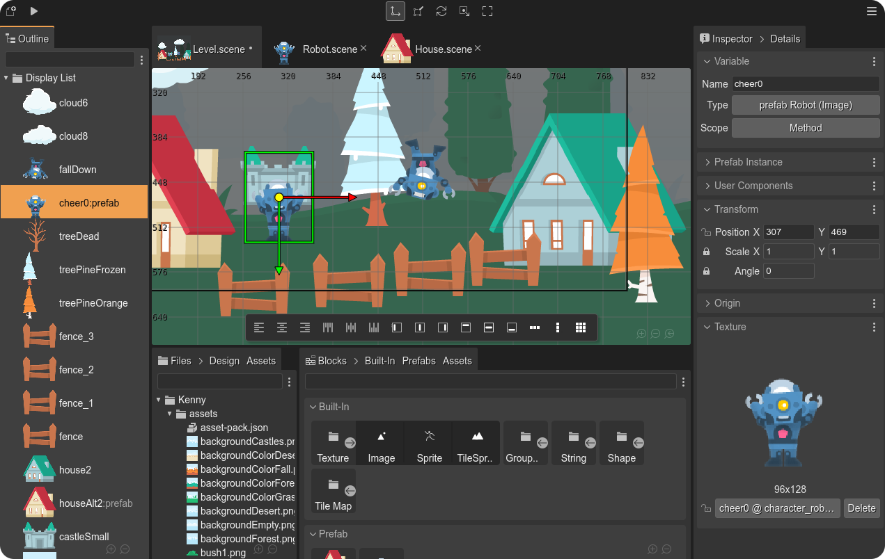

# Welcome! 👋

This is the account for all the [Phaser Editor 2D](https://phasereditor2d.com) projects.

## Main projects

These are some of the most important repositories:

* [PhaserEditor2D-v3](https://github.com/PhaserEditor2D/PhaserEditor2D-v3): contains the code of the IDE (the client side). This is the biggest piece of the editor.
* [PhaserEditor-v3-docs](https://github.com/PhaserEditor2D/PhaserEditor-v3-docs): the source files and images of the [Phaser Editor 2D Help](https://help.phasereditor2d.com/v3).
* [phasereditor2d-launcher](https://github.com/PhaserEditor2D/phasereditor2d-launcher): the code of the [NPM package](https://www.npmjs.com/package/phasereditor2d-launcher) for launching Phaser Editor 2D Core.
* [helpcenter-phaser3](https://github.com/PhaserEditor2D/helpcenter-phaser3): contains the code of the [Unofficial Phaser Help Center](https://helpcenter.phasereditor2d.com). It is a powerful tool for browsing the Phaser code and examples.

Other important resources are the [Phaser Editor 2D Starter projects](https://phasereditor2d.com/start):

## Starter resources

The starter resources are projects you can use for starting a new project, or starting learning Phaser Editor 2D.

### Starter templates

The basic templates for starting a new project:

* [starter-template-basic-javascript](https://github.com/PhaserEditor2D/starter-template-basic-javascript): the simplest project template.
* [starter-template-basic-typescript](https://github.com/PhaserEditor2D/starter-template-basic-typescript): a simple TypeScript-based project template.
* [starter-template-webpack](https://github.com/PhaserEditor2D/starter-template-webpack): a WebpackJS project template. The one I recommend for starting a large or professional project.

### Starter examples

Some basic game examples you can see for learning Phaser Editor 2D features:

* [starter-example-sunny-land](https://github.com/PhaserEditor2D/starter-example-sunny-land): an example of using [Tiled](https://www.mapeditor.org/) tilemaps and Arcade physics.
* [starter-example-volcano](https://github.com/PhaserEditor2D/starter-example-volcano): an example of a platformer game.
* [starter-example-a-day-in-the-beach](https://github.com/PhaserEditor2D/starter-example-a-day-in-the-beach): an example of a point-and-click game.

## Commercial

A huge part of Phaser Editor 2D is open source. However, it is a commercial product, and it requires a license for using it at its full potential:

* [Phaser Editor 2D Lifetime License](https://fornaris.gumroad.com/l/phasereditor)
* [Phaser Editor 2D Backers membership](https://fornaris.gumroad.com/l/phasereditor-backers)

## Contact

Contact me by:

* Creating an issue in any of the projects in this account.
* Chatting me in the [Phaser Editor 2D Discord server](https://discord.com/invite/4DdpMMD).
* Writing me an email to `developers@phasereditor2d.com`.

## Follow me

Also, you can follow `@PhaserEditor2D` on [Twitter](https://www.twitter.com/PhaserEditor2D) and [Facebook](https://www.facebook.com/PhaserEditor2D). 

Oh! And the [Phaser Editor 2D YouTube channel](https://www.youtube.com/c/PhaserEditor2D)!

By the way, I'm [Arian Fornaris](https://www.linkedin.com/in/arianfornaris/). Hi!
